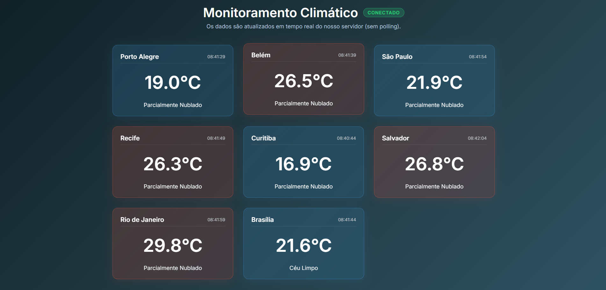

# Monitoramento de Temperatura em Tempo Real com WebSockets

Este projeto implementa um sistema distribuído de monitoramento climático utilizando o protocolo STOMP sobre WebSockets. O sistema demonstra a capacidade de um servidor "empurrar" (push) dados para múltiplos clientes simultaneamente, sem a necessidade de requisições repetitivas (polling).

## 1. Instruções de como rodar o projeto

O projeto foi desenvolvido em **Java 17** com **Spring Boot 3.2.x**, e não necessita de banco de dados, tornando sua execução muito simples. 

**Passos para execução via IntelliJ IDEA (Recomendado):**
1. Clone o repositório ou faça o download da pasta do projeto.
2. Abra a pasta `web-socket` na sua IDE (ex: **IntelliJ IDEA**).
3. Aguarde o IntelliJ carregar as dependências do Maven (você verá uma barra de carregamento no canto inferior direito).
4. No painel de navegação, vá até: `src/main/java/com/example/websocket/WebSocketApplication.java`.
5. Clique com o botão direito no arquivo `WebSocketApplication.java` e selecione **"Run 'WebSocketApplication.main()'"** (ou clique no ícone de "play" verde ao lado da declaração da classe).
6. O console mostrará a inicialização do Spring Boot na porta `8081`.
7. Abra o navegador web de sua escolha (Chrome, Firefox, Edge, etc.) e acesse:
   ➡️ **`http://localhost:8081`**
8. Observe o status de "Conectado" na parte superior da tela e aguarde as temperaturas aparecerem automaticamente.

*(Opcional) Execução via linha de comando se possuir o Maven instalado:*
```bash
mvn spring-boot:run
```

## 2. Explicação do fluxo de mensagens

O sistema é dividido em duas partes principais que conversam ativamente através do protocolo STOMP via WebSockets:

1. **Servidor (O Produtor/Backend):**
   - Utilizamos a anotação `@Scheduled(fixedRate = 5000)` para criar um *loop invisível* (agendamento) que dispara a cada **5 segundos**.
   - Em cada disparo, o servidor adota a seguinte **lógica de dados**: seleciona aleatoriamente uma cidade de uma lista de 10 cidades pré-definidas brasileiras (ex: São Paulo, Rio de Janeiro, Brasília, etc.).
   - Utilizando o `RestTemplate`, o servidor realiza uma requisição HTTP para a API pública e gratuita da **Open-Meteo**, buscando a temperatura e as condições atuais (céu limpo, chuva, etc) para as coordenadas dessa cidade.
   - Após agrupar as informações nos atributos obrigatórios (`cidade`, `temperatura`, `descricao`, `horario`), o servidor pega esse dado formatado em JSON e faz um **Broadcast** (envio para todos). Ele empurra (push) a mensagem para um tópico de mensagens STOMP predefinido chamado `/topic/clima`.

2. **Cliente Web (O Consumidor/Frontend):**
   - Ao acessar a página `index.html`, os scripts `sockjs.js` e `stomp.js` fazem o cliente conectar imediatamente ao WebSocket exposto no endereço `/ws`.
   - O cliente então assina (faz *subscribe*) no tópico `/topic/clima`.
   - A partir desse momento, ele apenas aguarda. Sempre que o servidor faz o broadcast de uma nova leitura a cada 5 segundos, a mensagem chega silenciosamente e em tempo real para o navegador.
   - O JavaScript coleta o objeto JSON recebido e insere um componente visual (um *Card*) no Dashboard com as informações. Ele constrói a lógica visual: se a `temperatura` lida for menor que 15°C, o card fica **azul**, se passar de 28°C ele adquire uma cor **vermelha** e entre isso se torna **verde**, além de verificar se a conexão está contínua e mostrar o Status ("Conectado").


## 3. Print da tela do sistema funcionando

*(Aqui está o espaço no qual você deve anexar as imagens que evidenciarão o funcionamento.)*



> **Nota para o aluno:** Para inserir a imagem para a entrega, tire um print screen do seu navegador com o sistema operando, salve a imagem na pasta raiz deste projeto com o nome `print_sistema.png`, sobrescrevendo/apagando se necessário. Se você renomear a imagem capturada, atualize o link no `README.md` acima.
